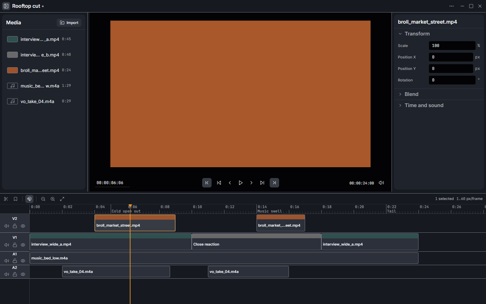

# Video Editor

A desktop video editor for one person. Multi-track timeline, keyboard-driven editing, ffmpeg
export. No accounts, no cloud, no telemetry, no project that lives anywhere but on your disk.

It is built as a tool, not as a product to sell: there is no onboarding, no upsell and nothing to
sign in to. The chrome stays dark and quiet so the frame is the only lit thing on screen.



## What it does

- Import video and audio; ffprobe reads duration, size, rate and codec, ffmpeg extracts a poster
  frame. Anything Chromium cannot decode is refused on the row that failed, with the reason.
- Multi-track timeline with drag, trim, split, ripple delete, snapping, markers and 100 steps of
  undo.
- Preview with real transport: play/pause, J-K-L shuttle, frame stepping, in and out points.
- Per-clip transform (scale, position, rotation, opacity), speed and volume in the inspector.
- Export to H.264, H.265 or ProRes at a chosen size, rate and quality, over the whole timeline or
  the in–out range. One ffmpeg process, real progress, working cancel.
- Projects save as `.veproj` — plain JSON you can read, diff and keep in version control.
- Three themes — `signal`, `instrument`, `daylight` — from the `…` menu in the title bar. Every
  palette is contrast-verified and none of them encodes state in hue alone.

## Running it

Requires Node 20+ and, for development, ffmpeg and ffprobe on `PATH`. A packaged build carries its
own copy and needs neither.

```
npm install
npm run dev          # vite + the real Electron app
```

Other entry points:

| Command | What it does |
| --- | --- |
| `npm run dev` | Vite dev server plus Electron. The real main process: real files, real ffmpeg. |
| `npm run dev:web` | Browser only, no main process. Loads fixtures so the UI can be worked on without Electron. Import, save and export are stubs there. |
| `npm run build` | Typecheck, build the renderer, compile the main process. |
| `npm start` | Run the built app without packaging it. |
| `npm run typecheck` | Both tsconfigs, no emit. |
| `npm run contract` | The design-contract checker: hardcoded colours, undefined tokens, missing theme values, removed focus rings, accent budget. |
| `npm run fixtures:media` | Generate `dev-media/` — synthetic clips to edit against. Needs ffmpeg. |

### If Electron will not start

`npm install` can leave `node_modules/electron` without its `path.txt` when the postinstall
download fails, and it fails **silently** — the install reports success and `npm start` then dies
with an unhelpful error. This has already happened once in this repo. The fix:

```
node node_modules/electron/install.js
```

## Keyboard

`Ctrl` is the platform accelerator: it is Cmd on macOS and Ctrl everywhere else. Every binding
below is generated from `src/keyboard/shortcuts.ts` by `npm run readme:keymap`, which is the same
registry the tooltips and the in-app overlay read — press `?` in the app for the same list.

Scope is focus containment, not hover: a timeline binding fires only while focus is inside the
timeline, which is why `Delete` in the media rail cannot remove a clip. Text fields and focused
buttons keep their own keys.

<!-- BEGIN KEYMAP: generated by scripts/gen-keymap.mjs — do not edit -->

**Anywhere**

| Keys | Action |
| --- | --- |
| `Space` | Play or pause |
| `J` | Shuttle backward |
| `K` | Stop shuttle |
| `L` | Shuttle forward |
| `Left` | Step back one frame |
| `Right` | Step forward one frame |
| `Shift+Left` | Step back one second |
| `Shift+Right` | Step forward one second |
| `Home` | Go to start |
| `End` | Go to end |
| `I` | Mark in |
| `O` | Mark out |
| `Ctrl+Z` | Undo |
| `Ctrl+Shift+Z` | Redo |
| `Escape` | Clear selection |
| `Ctrl+I` | Import media |
| `Ctrl+S` | Save project |
| `Ctrl+O` | Open project |
| `?` | Show keyboard shortcuts |

**Timeline**

| Keys | Action |
| --- | --- |
| `S` | Split at playhead |
| `Delete` | Lift selection |
| `Shift+Delete` | Ripple delete selection |
| `M` | Add marker at playhead |
| `+` or `=` | Zoom in |
| `-` | Zoom out |
| `Shift+Z` | Zoom to fit |

<!-- END KEYMAP -->

## Packaging

```
npm run dist
```

Produces, in `dist-release/`:

| Artifact | Size |
| --- | --- |
| `Video Editor 0.1.0 Setup.exe` | ~136 MB — NSIS installer, per-user, no administrator needed |
| `Video Editor 0.1.0 Portable.exe` | ~136 MB — runs without installing |
| `win-unpacked/` | ~463 MB — the installed layout, useful for testing |

The target is Windows x64. Configuration is in [`electron-builder.yml`](electron-builder.yml), and
every non-default setting there carries its reason.

Two things happen before the packager runs. `npm run icon` redraws `build/icon.png` from the
palette in `src/styles/tokens.css`, so the app mark cannot drift from the theme. `npm run
stage:ffmpeg` copies ffmpeg and ffprobe into `build/ffmpeg/` — see below.

**The installer is not code-signed.** There is no certificate, so Windows SmartScreen will say
"Windows protected your PC" the first time you run it; *More info → Run anyway*. Signing it means
buying a certificate and adding `win.certificateFile` to the config. Nothing else has to change.

## ffmpeg

The app shells out to `ffmpeg` and `ffprobe`. It does not link them and does not depend on an npm
wrapper, which keeps the dependency list honest but leaves one question: where do the binaries come
from on a machine that is not this one?

**They ship with the app.** `scripts/stage-ffmpeg.mjs` copies both binaries into `build/ffmpeg/`,
electron-builder places them at `resources/ffmpeg/`, and `electron/ffmpeg.ts` resolves them at
runtime — bundled when packaged, `PATH` in development, `PATH` as the fallback in both.

That choice costs about 193 MB in the installer, which is most of its size. It was made anyway,
because the alternative is an installer that works on the machine that built it and fails on every
other one, and "install ffmpeg first" is not an installer. `PATH` remains a real fallback rather
than dead code: if the bundled copy is missing — a partial install, an antivirus quarantine, a
hand-assembled build — the app looks for a system ffmpeg before giving up, and only then reports
`ffmpeg-missing` on the affected row or in the export dialog.

Two details worth knowing:

- The staged binaries come from whatever is on the build machine's `PATH`, or from `FFMPEG_DIR` if
  you set it. There is no download step; a packaging script that needs the network fails on the
  machine that most needs it to work.
- **Licensing.** A typical Windows ffmpeg build (including the `gyan.dev` "essentials" build this
  was packaged against) is compiled with `--enable-gpl --enable-version3`. Shipping it means the
  distributed application is subject to GPLv3. That is fine for a personal tool; it is a real
  obligation if you redistribute. Build ffmpeg LGPL if you need to avoid it.

`npm run dist:nobundle` builds without ffmpeg: an 82 MB installer, ~54 MB smaller, that only runs
on machines which already have both binaries on `PATH`. It empties `build/ffmpeg/` rather than
merely skipping the copy, so it cannot accidentally ship the previous run's binaries.

To point a development run at a specific ffmpeg — including at the copy inside a packaged build:

```
VE_FFMPEG_DIR=/path/to/folder-with-the-binaries npm run dev
```

The main process logs which one it resolved at startup: `[ffmpeg] ffmpeg=bundled:… ffprobe=bundled:…`

## Known limitations

These are design decisions and honest gaps, not bugs.

- **Windows x64 only.** Nothing in the code is Windows-specific and it runs under `npm run dev` on
  other platforms, but no macOS or Linux target is configured and neither has been packaged or
  tested.
- **The preview composites the topmost visible video clip, and so does the export.** Transform,
  opacity and speed apply to that clip against the background. Stacked video tracks decide *which*
  clip is on top; they do not blend. Audio tracks do mix.
- **No transitions, titles, effects or colour correction.** A cut is a cut.
- **Nothing autosaves.** `Ctrl+S` is the only thing that writes a project, and closing the window
  does not stop to ask about unsaved changes. The dot beside the project name in the title bar is
  the only warning you get.
- **One export at a time per window.** Starting a second reports that one is already running rather
  than queueing it.
- **The installer is unsigned** — see above.
- **No update mechanism.** New version, new installer.
- **`dev:web` is not the app.** It exists so the interface can be worked on in a browser; its
  import, save and export are stubs. Anything involving real files has to be checked in Electron.

## Layout

```
electron/          main process — window, ve-media:// protocol, ffmpeg resolution, IPC
  ffmpeg.ts        the single answer to "which ffmpeg?"
  export/graph.ts  the timeline compiled to one ffmpeg filter graph
  ipc/             media probing, project read/write, the export job
src/
  components/      shell, media rail, preview, timeline, inspector, export dialog, ui primitives
  state/           one zustand store, four slices
  keyboard/        the shortcut registry every tooltip and the overlay read
  styles/          tokens.css — the only file allowed to contain a colour
scripts/           contract checker, icon, ffmpeg staging, keymap generation, media fixtures
docs/              PLAN.md (implementation), EXPORT.md (the ffmpeg contract)
```

`PRODUCT.md` and `DESIGN.md` at the root carry the design principles and the visual system. Read
them before touching the interface; `npm run contract` enforces the parts of them a machine can
check.
